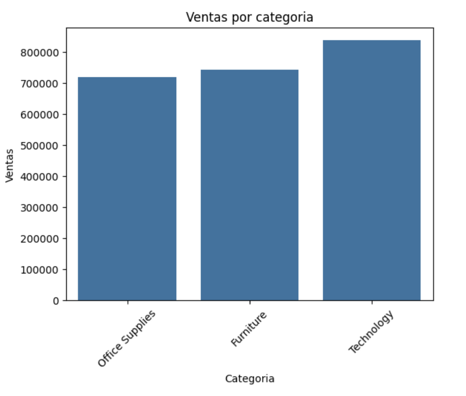
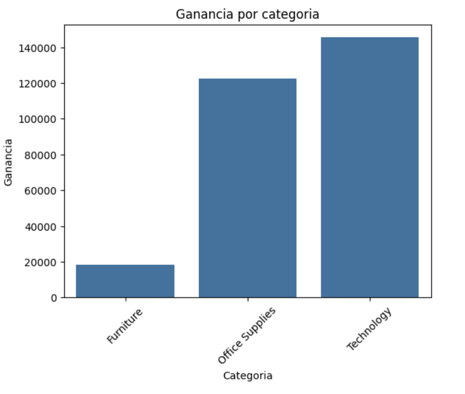
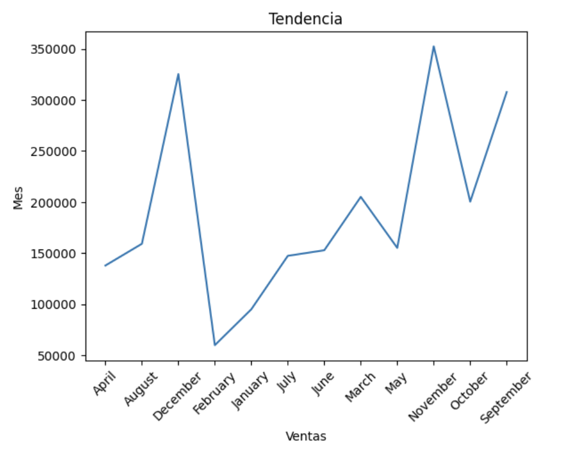
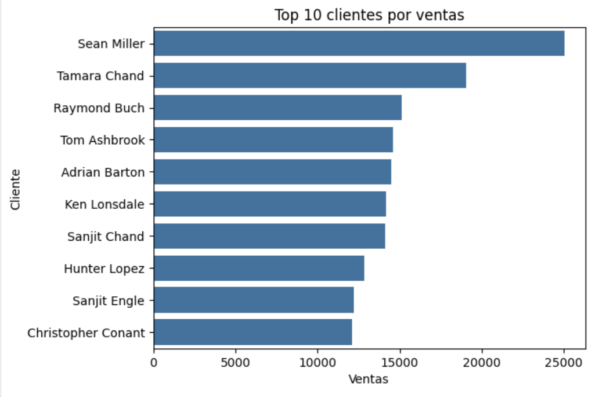
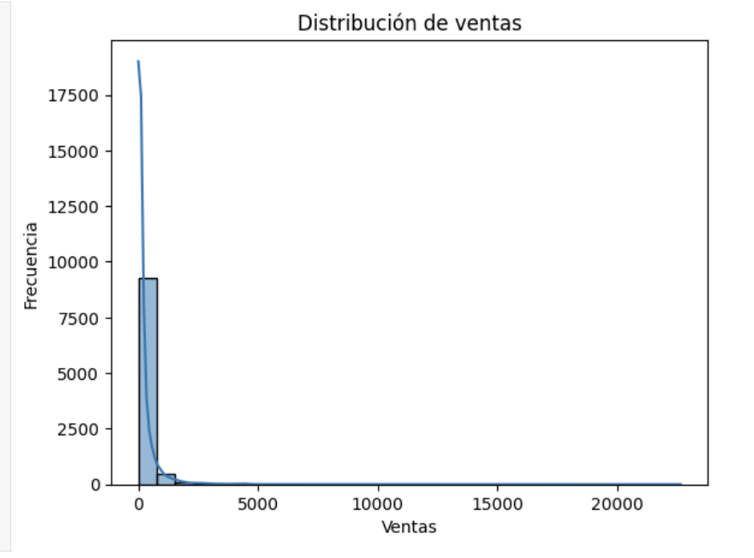
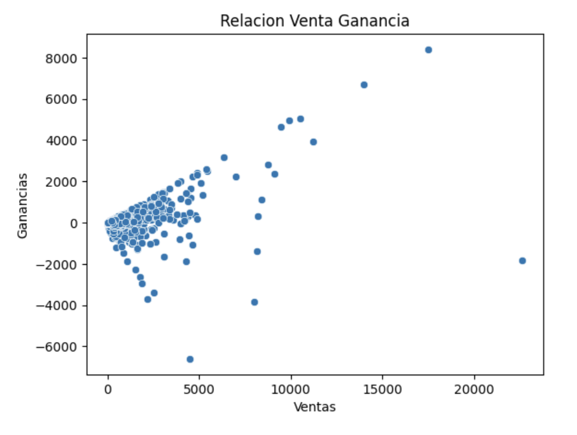

# 🛒 Superstore Sales Analysis

> A comprehensive end-to-end exploratory data analysis (EDA) of retail sales data, uncovering actionable business insights across product categories, customer segments, and time periods.

---

## 📌 Project Overview

This project dives deep into a retail Superstore dataset to understand what drives revenue and profitability. By combining data wrangling, statistical analysis, and rich visualizations, this analysis surfaces the key levers that business stakeholders can act on — from which product categories deserve investment to which customers generate the most value.

**Core business questions answered:**
- Which product categories generate the most sales and profit?
- Who are the highest-value customers?
- How do sales fluctuate across the calendar year?
- Is there a consistent relationship between high sales and high profit?
- How is revenue distributed across individual transactions?

---

## 🧰 Tech Stack

| Tool | Purpose |
|---|---|
| **Python** | Core programming language |
| **Pandas** | Data loading, cleaning, and transformation |
| **Matplotlib** | Base charting and figure customization |
| **Seaborn** | Statistical visualizations and styling |
| **Jupyter Notebook** | Interactive analysis environment |

---

## 📂 Project Structure

```
superstore-sales-analysis/
│
├── data/
│   └── superstore.csv              # Raw dataset
│
├── images/
│   ├── sales_by_category.png
│   ├── profit_by_category.png
│   ├── monthly_sales_trend.png
│   ├── top_10_customers.png
│   ├── sales_distribution.png
│   └── sales_vs_profit.png
│
├── notebooks/
│   └── superstore_eda.ipynb        # Full analysis notebook
│
├── README.md
└── requirements.txt
```

---

## 📊 Dashboard Preview

### 1. Sales by Category
> Technology leads total revenue, followed closely by Furniture and Office Supplies — all three categories are within a competitive range, suggesting broad portfolio strength.



---

### 2. Profit by Category
> While sales are relatively balanced across categories, **profit tells a very different story**. Technology generates the highest profit margin, Office Supplies follows at a healthy level, and Furniture significantly lags — indicating potential pricing or cost issues in that segment.



---

### 3. Monthly Sales Trend
> Sales show a volatile seasonal pattern with clear peak months. The business experiences sharp spikes and troughs throughout the year, suggesting strong seasonality that should inform inventory planning and promotional calendars.



---

### 4. Top 10 Customers by Sales
> A small cohort of customers accounts for a disproportionate share of revenue. **Sean Miller** stands out as the highest-value customer by a significant margin, with Tamara Chand and Raymond Buch rounding out the top three — a prime segment for loyalty and retention strategies.



---

### 5. Sales Distribution
> The distribution of individual transaction values is highly right-skewed: the vast majority of orders are low-value, while a small number of high-ticket transactions extend far into the tail. This pattern is typical of B2B retail and suggests upsell opportunities on large accounts.



---

### 6. Sales vs. Profit Relationship
> The scatter plot reveals a **generally positive but noisy relationship** between sales and profit. Notably, some high-sales transactions yield negative profit — pointing to heavy discounting or cost overruns that deserve further investigation. Outliers with extreme losses warrant individual review.



---

## 🔍 Key Business Insights

1. **Technology is your profit engine.** Despite similar top-line sales to other categories, Technology delivers far superior margins. Prioritizing this category in marketing and inventory could yield disproportionate profit gains.

2. **Furniture is a margin problem.** High sales volume but low profit in Furniture suggests structural issues — likely aggressive discounting or high fulfillment costs. A pricing audit is recommended.

3. **Seasonality requires proactive planning.** Monthly sales volatility is high. Identifying the root causes of peak and trough months enables smarter staffing, inventory, and promotional decisions.

4. **Top customers deserve white-glove treatment.** The top 10 customers represent outsized revenue concentration. Dedicated account management and personalized retention programs could protect and grow this revenue base.

5. **Not all large deals are profitable.** The sales-profit scatter reveals several high-revenue, negative-profit transactions. A deal profitability review — particularly for discounted orders — could recover significant margin.

---

## 🚀 Getting Started

```bash
# Clone the repository
git clone https://github.com/your-username/superstore-sales-analysis.git
cd superstore-sales-analysis

# Install dependencies
pip install -r requirements.txt

# Launch the notebook
jupyter notebook notebooks/superstore_eda.ipynb
```

**Requirements:**
```
pandas
matplotlib
seaborn
jupyter
```

---

## 📄 Dataset

This project uses the publicly available **Superstore Sales dataset**, a widely used sample retail dataset containing orders, customers, products, and financial performance data across multiple regions and time periods.

---

## 👤 Author

**Your Name**
- GitHub: [@your-username](https://github.com/your-username)
- LinkedIn: [linkedin.com/in/your-profile](https://linkedin.com/in/your-profile)

---

## 📝 License

This project is licensed under the MIT License — see the [LICENSE](LICENSE) file for details.

---

*If you found this project useful, consider giving it a ⭐ — it helps others discover it!*
